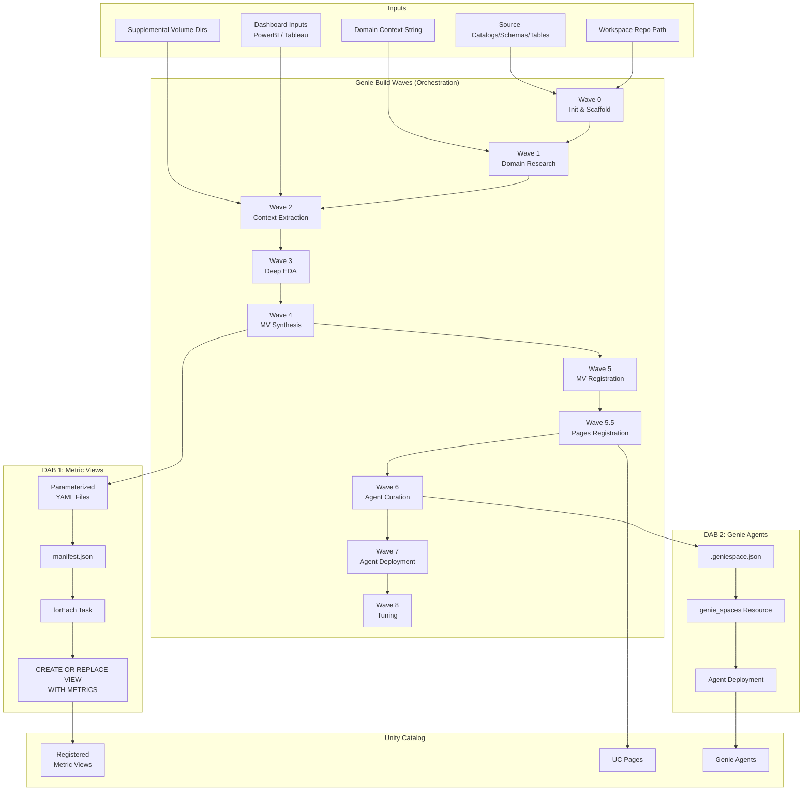

# SDK Architecture Overview

```mermaid
graph TB
    subgraph Inputs
        CAT[Source Catalogs/Schemas/Tables]
        VOL[Supplemental Volume Dirs]
        DASH[Dashboard Inputs<br/>PowerBI / Tableau]
        CTX[Domain Context String]
        REPO[Workspace Repo Path]
    end

    subgraph "Genie Build Waves (Orchestration)"
        W0[Wave 0<br/>Init & Scaffold]
        W1[Wave 1<br/>Domain Research]
        W2[Wave 2<br/>Context Extraction]
        W3[Wave 3<br/>Deep EDA]
        W4[Wave 4<br/>MV Synthesis]
        W5[Wave 5<br/>MV Registration]
        W55[Wave 5.5<br/>Pages Registration]
        W6[Wave 6<br/>Agent Curation]
        W7[Wave 7<br/>Agent Deployment]
        W8[Wave 8<br/>Tuning]
    end

    subgraph "DAB 1: Metric Views"
        MV_YAML[Parameterized<br/>YAML Files]
        MANIFEST[manifest.json]
        FOREACH[forEach Task]
        REG[CREATE OR REPLACE VIEW<br/>WITH METRICS]
    end

    subgraph "DAB 2: Genie Agents"
        GS_JSON[.geniespace.json]
        GS_RES[genie_spaces Resource]
        DEPLOY[Agent Deployment]
    end

    subgraph "Unity Catalog"
        MV_UC[Registered<br/>Metric Views]
        PAGES[UC Pages]
        AGENTS[Genie Agents]
    end

    CAT --> W0
    VOL --> W2
    DASH --> W2
    CTX --> W1
    REPO --> W0

    W0 --> W1 --> W2 --> W3 --> W4 --> W5 --> W55 --> W6 --> W7 --> W8

    W4 --> MV_YAML
    MV_YAML --> MANIFEST
    MANIFEST --> FOREACH
    FOREACH --> REG
    REG --> MV_UC

    W55 --> PAGES

    W6 --> GS_JSON
    GS_JSON --> GS_RES
    GS_RES --> DEPLOY
    DEPLOY --> AGENTS
```
