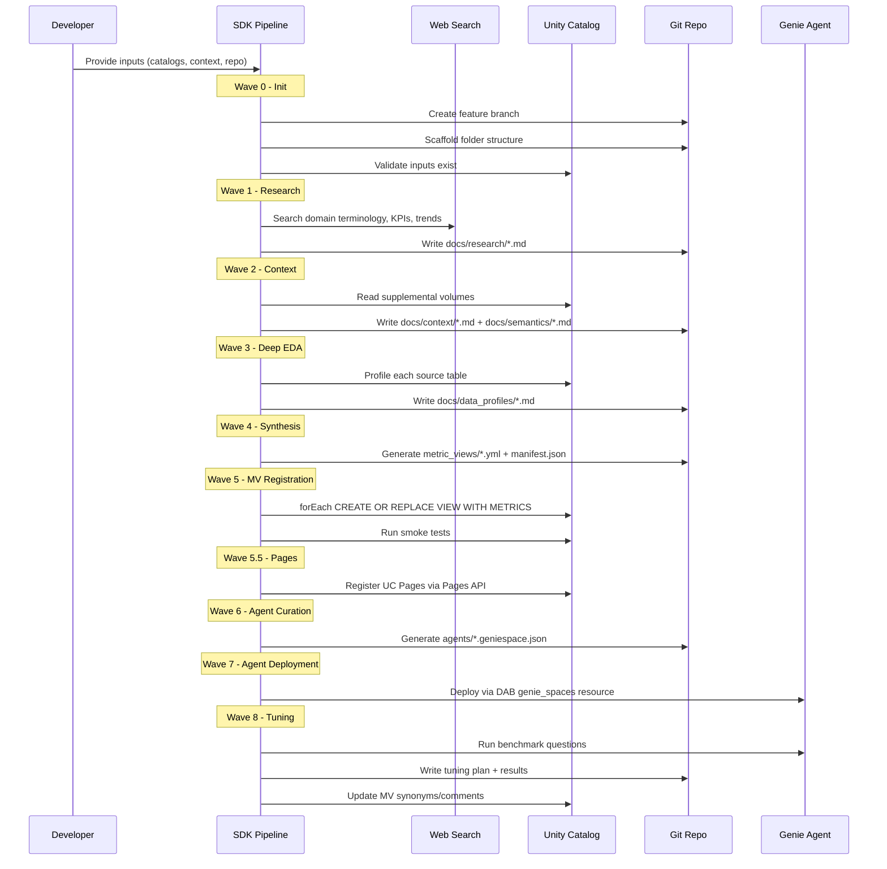

# Genie Build Waves Sequence

```mermaid
sequenceDiagram
    participant Dev as Developer
    participant SDK as SDK Pipeline
    participant Web as Web Search
    participant UC as Unity Catalog
    participant Repo as Git Repo
    participant Agent as Genie Agent

    Dev->>SDK: Provide inputs (catalogs, context, repo)

    Note over SDK: Wave 0 - Init
    SDK->>Repo: Create feature branch
    SDK->>Repo: Scaffold folder structure
    SDK->>UC: Validate inputs exist

    Note over SDK: Wave 1 - Research
    SDK->>Web: Search domain terminology, KPIs, trends
    SDK->>Repo: Write docs/research/*.md

    Note over SDK: Wave 2 - Context
    SDK->>UC: Read supplemental volumes
    SDK->>Repo: Write docs/context/*.md + docs/semantics/*.md

    Note over SDK: Wave 3 - Deep EDA
    SDK->>UC: Profile each source table
    SDK->>Repo: Write docs/data_profiles/*.md

    Note over SDK: Wave 4 - Synthesis
    SDK->>Repo: Generate metric_views/*.yml + manifest.json

    Note over SDK: Wave 5 - MV Registration
    SDK->>UC: forEach CREATE OR REPLACE VIEW WITH METRICS
    SDK->>UC: Run smoke tests

    Note over SDK: Wave 5.5 - Pages
    SDK->>UC: Register UC Pages via Pages API

    Note over SDK: Wave 6 - Agent Curation
    SDK->>Repo: Generate agents/*.geniespace.json

    Note over SDK: Wave 7 - Agent Deployment
    SDK->>Agent: Deploy via DAB genie_spaces resource

    Note over SDK: Wave 8 - Tuning
    SDK->>Agent: Run benchmark questions
    SDK->>Repo: Write tuning plan + results
    SDK->>UC: Update MV synonyms/comments
```
