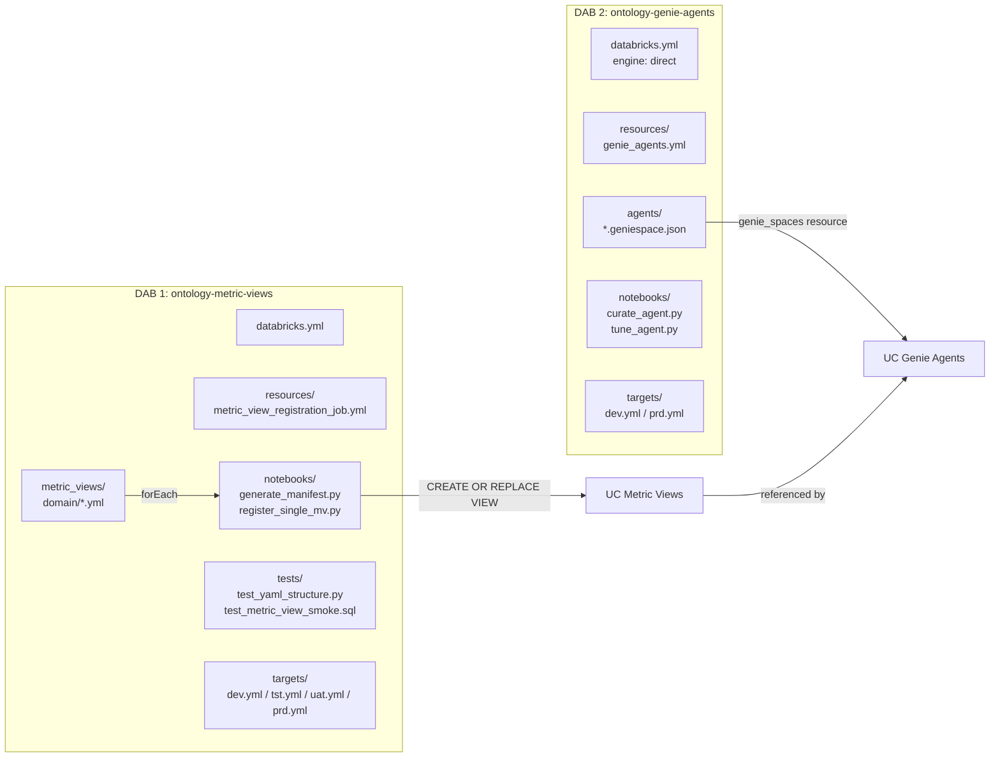

# Two-DAB Deployment Model

```mermaid
graph LR
    subgraph "DAB 1: ontology-metric-views"
        D1_YML[databricks.yml]
        D1_RES[resources/<br/>metric_view_registration_job.yml]
        D1_MV[metric_views/<br/>domain/*.yml]
        D1_NB[notebooks/<br/>generate_manifest.py<br/>register_single_mv.py]
        D1_TEST[tests/<br/>test_yaml_structure.py<br/>test_metric_view_smoke.sql]
        D1_TGT[targets/<br/>dev.yml / tst.yml / uat.yml / prd.yml]
    end

    subgraph "DAB 2: ontology-genie-agents"
        D2_YML[databricks.yml<br/>engine: direct]
        D2_RES[resources/<br/>genie_agents.yml]
        D2_AGT[agents/<br/>*.geniespace.json]
        D2_NB[notebooks/<br/>curate_agent.py<br/>tune_agent.py]
        D2_TGT[targets/<br/>dev.yml / prd.yml]
    end

    D1_MV -->|forEach| D1_NB
    D1_NB -->|CREATE OR REPLACE VIEW| UC_MV[UC Metric Views]
    D2_AGT -->|genie_spaces resource| UC_GA[UC Genie Agents]

    UC_MV -->|referenced by| UC_GA
```
