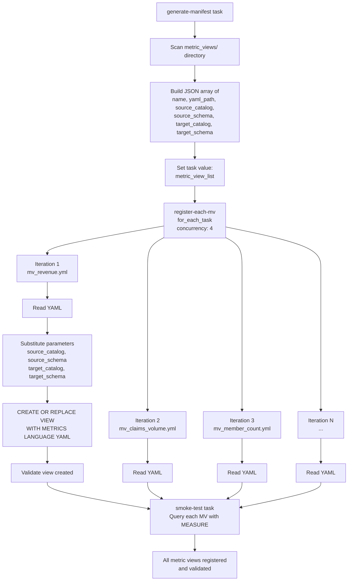

# forEach Registration Flow

```mermaid
flowchart TD
    START[generate-manifest task] --> SCAN[Scan metric_views/ directory]
    SCAN --> BUILD[Build JSON array of<br/>name, yaml_path, source_catalog,<br/>source_schema, target_catalog, target_schema]
    BUILD --> TASKVAL[Set task value:<br/>metric_view_list]

    TASKVAL --> FOREACH[register-each-mv<br/>for_each_task<br/>concurrency: 4]

    FOREACH --> IT1[Iteration 1<br/>mv_revenue.yml]
    FOREACH --> IT2[Iteration 2<br/>mv_claims_volume.yml]
    FOREACH --> IT3[Iteration 3<br/>mv_member_count.yml]
    FOREACH --> ITN[Iteration N<br/>...]

    IT1 --> READ1[Read YAML]
    READ1 --> SUB1[Substitute parameters<br/>source_catalog, source_schema<br/>target_catalog, target_schema]
    SUB1 --> EXEC1[CREATE OR REPLACE VIEW<br/>WITH METRICS LANGUAGE YAML]
    EXEC1 --> VAL1[Validate view created]

    IT2 --> READ2[Read YAML]
    IT3 --> READ3[Read YAML]
    ITN --> READN[Read YAML]

    VAL1 --> SMOKE[smoke-test task<br/>Query each MV with MEASURE]
    READ2 --> SMOKE
    READ3 --> SMOKE
    READN --> SMOKE

    SMOKE --> DONE[All metric views registered<br/>and validated]
```
