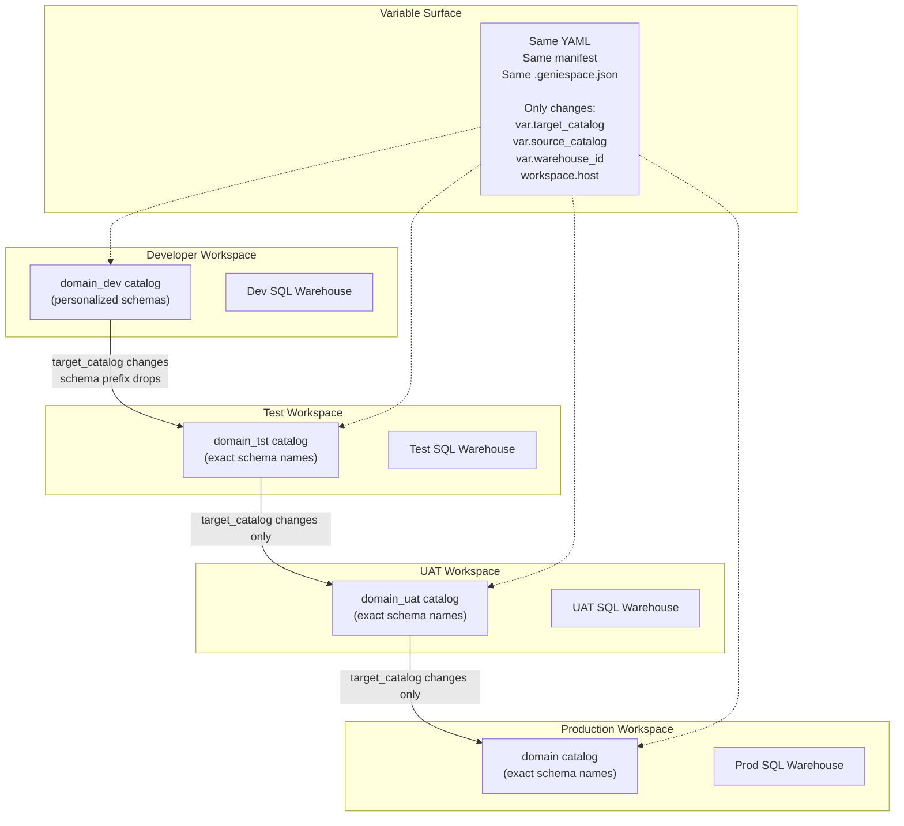

# CI/CD Promotion Path

```mermaid
graph TD
    subgraph "Developer Workspace"
        DEV_CAT["domain_dev catalog<br/>(personalized schemas)"]
        DEV_WH[Dev SQL Warehouse]
    end

    subgraph "Test Workspace"
        TST_CAT["domain_tst catalog<br/>(exact schema names)"]
        TST_WH[Test SQL Warehouse]
    end

    subgraph "UAT Workspace"
        UAT_CAT["domain_uat catalog<br/>(exact schema names)"]
        UAT_WH[UAT SQL Warehouse]
    end

    subgraph "Production Workspace"
        PRD_CAT["domain catalog<br/>(exact schema names)"]
        PRD_WH[Prod SQL Warehouse]
    end

    DEV_CAT -->|"target_catalog changes<br/>schema prefix drops"| TST_CAT
    TST_CAT -->|"target_catalog changes only"| UAT_CAT
    UAT_CAT -->|"target_catalog changes only"| PRD_CAT

    subgraph "Variable Surface"
        VAR[Same YAML<br/>Same manifest<br/>Same .geniespace.json<br/><br/>Only changes:<br/>var.target_catalog<br/>var.source_catalog<br/>var.warehouse_id<br/>workspace.host]
    end

    VAR -.-> DEV_CAT
    VAR -.-> TST_CAT
    VAR -.-> UAT_CAT
    VAR -.-> PRD_CAT
```
